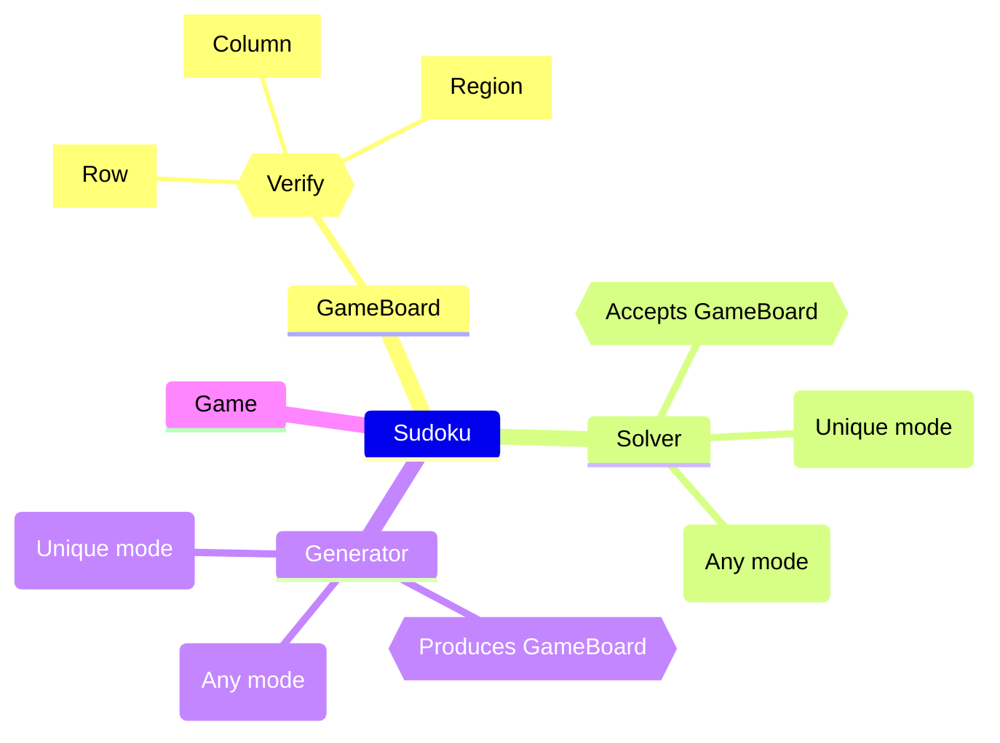

# Sudoku

Sudoku is a number game in which the objective is to take a 9x9 grid and fill it with numbers 1-9 such that each row, column, and 9 3x3 subgrid contain all of the numbers 1-9 exactly once.

The goals of this project are to:
* Implement a sudoku solver that can solve any valid sudoku puzzle
* Implement a sudoku generator that can generate valid sudoku puzzles
* Implement a sudoku game that allows a user to play Sudoku

Future Goals
* Explore the mathematics behind Sudoku and allow for a greater understanding of how to solve boards
    * Coaching for users to better understand these principals. Since implementation by definition requires a bit of understanding.
    * Implement a feature that allows the user to see the steps the solver took to solve the board.
    * Implement a feature that allows the user to see the steps the generator took to generate the board.
* Implement generic N-Doku. Since Sudoku can, in principle, be generalized to boards of size N, it would be interesting to optimize the application for this use case.

## Modules

